# Compute

There are multiple types of [resources](resources.md) you may need.
This page is about finding a place to run heavy calculations on:
it shows a flowchart how to determine the computational resource
you can use, followed by an overview of all resources.

```mermaid
flowchart TD

  subgraph researcher_on_sensitive_data[Researcher, sensitive data]
    arrhenius_rs[Arrhenius]
    bianca[Bianca]
    cosmos_sens[COSMOS SENS or LUSEC]    
    data_science_platform_rs[Data Science Platform]
    lumi_rs[LUMI]
    maja[Maja]
    trusted_research_environment_rs[Trusted Research Environment]

    question_custom_rs[Need a custom setup or a GPU-focused system?]
    question_custom_rs --> |Yes| data_science_platform_rs
    question_custom_rs --> |No| question_where_rs

    question_where_rs[Where are you located?]
    question_where_rs --> |Sweden| bianca
    question_where_rs --> |Lund| cosmos_sens
    question_where_rs --> |Gothenburg| trusted_research_environment_rs

    bianca -.-> |Future| maja
    bianca -.-> |Future| arrhenius_rs

  end

  subgraph researcher_on_regular_data[Researcher, regular data]
    alvis[Alvis]
    arrhenius_rr[Arrhenius]
    berzelius[Berzelius]
    cosmos[COSMOS]
    dardel[Dardel]
    data_science_platform_rr[Data Science Platform]
    kebnekaise[Kebnekaise]
    lumi[LUMI]
    pelle[Pelle]
    rackham[Rackham]
    sigma[Sigma]
    tetralith[Tetralith]
    vera[Vera]

    question_custom_rr[Need a custom setup?]
    question_custom_rr --> |Yes| data_science_platform_rr
    question_custom_rr --> |No| question_very_heavy_compute_rr

    question_very_heavy_compute_rr[Need very heavy compute?]
    question_very_heavy_compute_rr --> |Yes| lumi
    question_very_heavy_compute_rr --> |No| question_ai

    question_ai[Are you working with AI?]
    question_ai --> |Yes| question_kaw
    question_ai --> |No| question_where_rr

    question_kaw[Are you affiliated with KAW, DDLS, WASP, or similar?]
    question_kaw --> |Yes| berzelius
    question_kaw --> |No| alvis

    question_where_rr[Where are you located?]
    question_where_rr --> |Lund| cosmos
    question_where_rr --> |Sweden| dardel
    question_where_rr --> |Lund| kebnekaise
    question_where_rr --> |Sweden| tetralith
    question_where_rr --> |Linköping| sigma
    question_where_rr --> |Gothenburg| vera
    question_where_rr --> |Uppsala| rackham

    rackham -.-> |Future| pelle
    rackham -.-> |Future| arrhenius_rr

  end
  
  subgraph anyone_on_any_data[Anyone, any data]
    aa_data_science_platform[Data Science Platform]
  end

  job_question[Are you a researcher?]

  job_question --> |No| anyone_on_any_data
  job_question --> |Yes| sensitivity_question

  sensitivity_question[Do you work with sensitive data?]
  sensitivity_question --> |Yes| researcher_on_sensitive_data
  sensitivity_question --> |No| researcher_on_regular_data

  researcher_on_sensitive_data ~~~ researcher_on_regular_data 
```

???- question "Why is this a useful resource?"

    This page is the only page that combines all the computational resources
    of all the different providers.

???- question "How is this list generated and updated?"

    On a daily basis,
    [the `update_content.yaml` continuous integration script](https://github.com/NBISweden/SCoRe_user_doc/blob/main/.github/workflows/update_content.yaml)
    checks the websites of the course providers and updates the list,
    using [the `scoreto` R package](https://github.com/richelbilderbeek/scoreto).

???- question "A compute provider is missing!"

    If a compute provider is missing, please [contribute](CONTRIBUTING.md)
    or [contact us](contact_us.md).

???- question "My compute resource is absent!"

    If your compute resource is absent, please [contribute](CONTRIBUTING.md)
    or [contact us](contact_us.md).

???- question "My compute resource can be displayed better!"

    If your compute resource can be displayed better,
    please [contribute](CONTRIBUTING.md)
    or [contact us](contact_us.md).

???- question "How can I read this data is a machine-friendly format?"

    This information can be downloaded as a `.csv` from
    [the `scoreto` R package](https://github.com/richelbilderbeek/scoreto/blob/main/inst/extdata/compute.csv).

<!-- compute_2.md is machine-generated and -->
<!-- pasted below this file, compute_1.md -->
