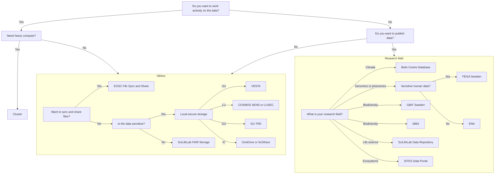

# Storage

There are multiple types of [resources](resources.md) you may need.
This page is about finding a place to store big amounts of data:
it shows a flowchart how to determine the storage resource
you can use, followed by an overview of all resources.

Before you start, you should probably do a data classification
and write a data management plan.

Further things to consider include things like keeping a backup,
versioning, etc, but the flowchart below can be a useful start.
We will happily discuss your needs and help you find something suitable.

???- question "Why is this a useful resource?"

    This page is the only page that combines all the storage resources
    of all the different providers.

???- question "How is this list generated and updated?"

    On a daily basis,
    [the `update_content.yaml` continuous integration script](https://github.com/NBISweden/SCoRe_user_doc/blob/main/.github/workflows/update_content.yaml)
    checks the websites of the course providers and updates the list,
    using [the `scoreto` R package](https://github.com/richelbilderbeek/scoreto).

???- question "A storage provider is missing!"

    If a storage provider is missing, please [contribute](CONTRIBUTING.md)
    or [contact us](contact_us.md).

???- question "My storage resource is absent!"

    If your storage resource is absent, please [contribute](CONTRIBUTING.md)
    or [contact us](contact_us.md).

???- question "My storage resource can be displayed better!"

    If your storage resource can be displayed better,
    please [contribute](CONTRIBUTING.md)
    or [contact us](contact_us.md).

???- question "How can I read this data is a machine-friendly format?"

    This information can be downloaded as a `.csv` from
    [the `scoreto` R package](https://github.com/richelbilderbeek/scoreto/blob/main/inst/extdata/storage.csv).

<!-- storage_2.md is machine-generated and -->
<!-- pasted below this file, storage_1.md -->
